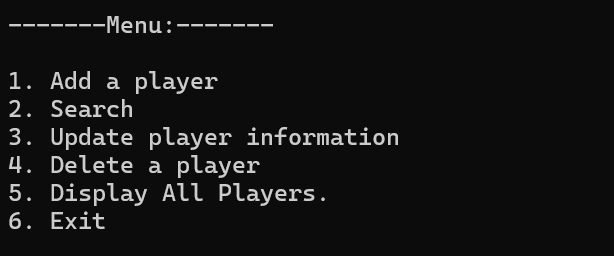
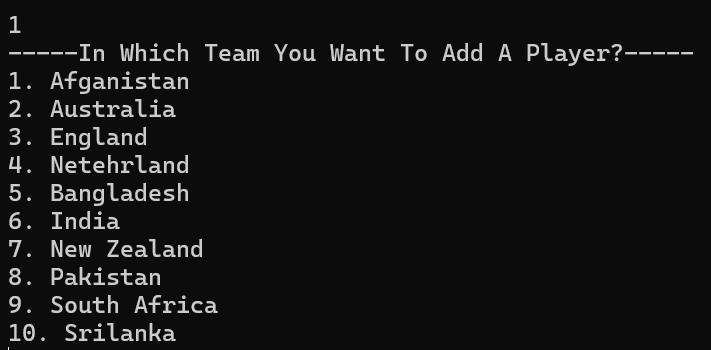
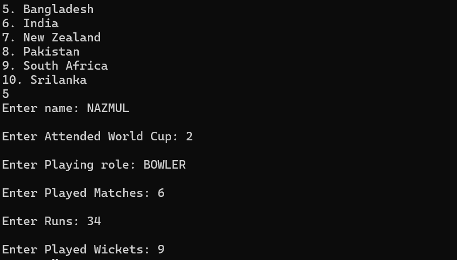
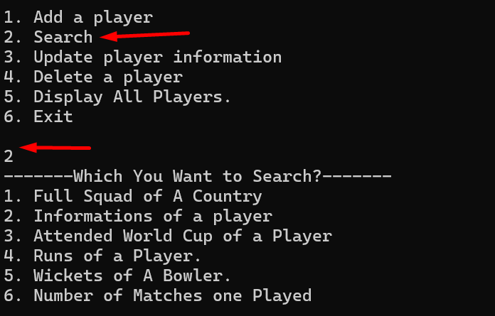
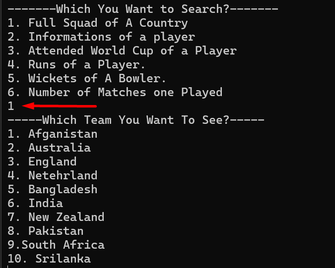
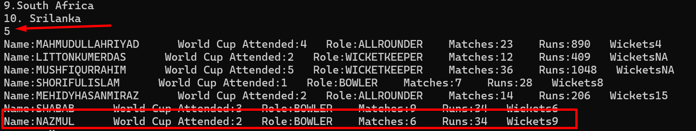
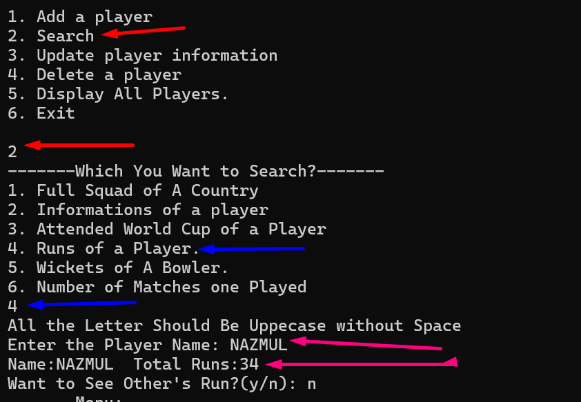

# ICC Men's ODI World Cup 2023 Players Database
This is a group project of my Data Structure and Algorithm course, back in 2022. We were 4 members. Basically, this application stores ICC World Cup players data. We did it using file handling. We used linked-list in this project.
In this application one can add, update and delete any teams or players informations. We used c++ in it.

I build the insertion and Search part of this project.

## Screenshots
- After running this project user will land on a menue, where he/she can enter associated integer number to perform specific action.

- By choosing 1, another menu will be shown and user should choose a particular country.

  

- Followed by country selection, user will be prompted to enter specific information about a player as given image.
   
   

>**⚠️⚠️Note:** Searching and Inserting player's info is not case sensitive. In between spaces will be trimed and all the characters will turned into uppercase.

- If user enter 2, then he/she can search for 6 categories of info are as below screenshot:
  
  

- Then user will be asked for country selection.

  

- After entering country number, user will be shown the whole team's info.

   

And as you can see, our inserted player's information has been revealed!

- User can also search for different different infos of individual players by simply entering player's name.
 
  

>**⚠️⚠️Note:** Searching and Inserting player's info is not case sensitive. In between spaces will be trimed and all the characters will turned into uppercase.
